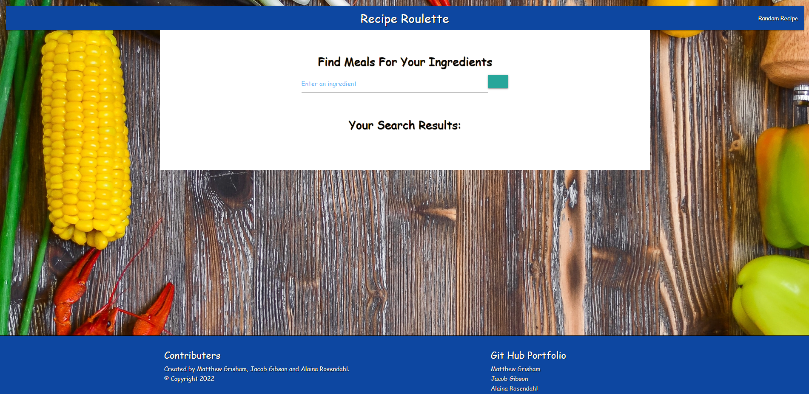

# <strong> <u>Recipe Roulette</u> </Strong>

## Table of Contents

- [Opening Statement](#opening-statement)
- [About](#about)
- [Liability](#liability)
- [Sources](#sources)
- [Copyright and license](#copyright-and-license)

### Opening Statement

- GIVEN I am hungry and want to create a meal
- WHEN I open Recipe Roulette
- THEN I am presented with the option to add the ingredients that I have.
- WHEN I search using my ingredients
- THEN I am presented with potential recepies
- WHEN I click on the recepie
- THEN it takes me to a page with instructions on how to prepare the meal

### About

If you are lookin to start cookin! Then you have come to the right place! Whether you have alot of ingredients, or you want to MacGyver something together for dinner tonight, we can help you! Click the search bar, and enter in the ingredients that you have by your side. Once that is finished, simply select a the meal that you have ingredients for, and follow the directions!

### Liability

<u>**WARNING**</u>
 **If you are the type of person that likes to skydive by throwing your parachute out of the plane and catching it on the way down! Then you can simply click our Random Recipe button. Both are as equally exhilarating.** 

<u>**Disclaimer**</u>
Not liable for shotty cooking, house fires, or any other risk or accident from following our recepies. 

The following below is what the application looks like in your browser.

#### Sources

- https://www.themealdb.com/api.php

#### Copyright and license:

We do not have any kid of Copyright or License pertaining to this website. this was made for educational purposes only.
